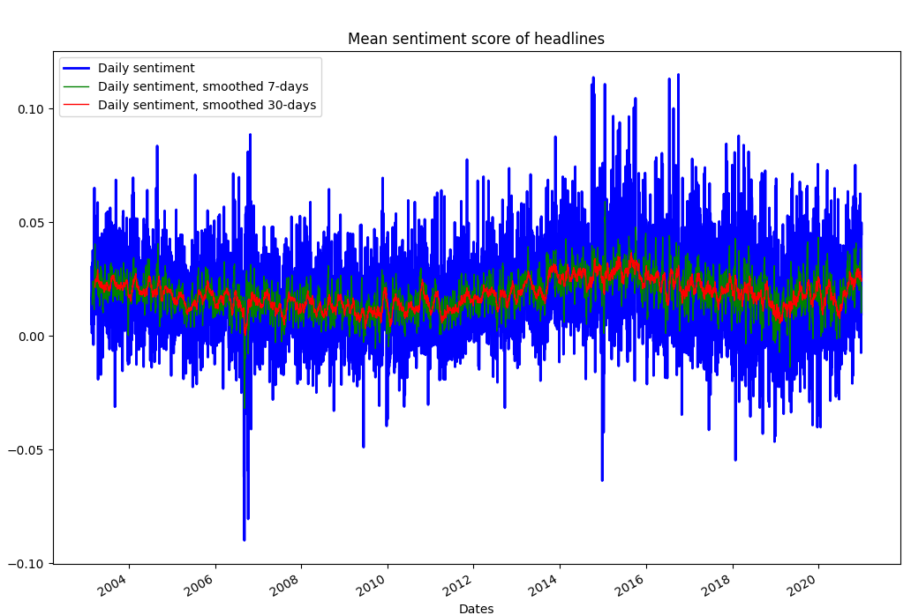

<!-- PROJECT LOGO -->
<br />
<p align="center">
  <a href="https://github.com/emiltj/cds-language-exam">
    
  </a>
  <h1 align="center">CDS Language Analytics</h1>

  <p align="center">
    Exam portfolio
    <br />
    <a href="https://github.com/emiltj/cds-language-exam/blob/main/report.pdf"><strong>Read about the entire portfolio here»</strong></a>
    <br />
    <a href="https://github.com/emiltj/cds-language-exam/issues">Report Bug</a>
    ·
    <a href="https://github.com/emiltj/cds-language-exam/issues">Request Feature</a>
  </p>
</p>

<!-- TABLE OF CONTENTS -->
<details open="open">
  <summary>Table of Contents</summary>
  <ol>
    <li><a href="#about-the-project">About the project</a></li>
    <li><a href="#getting-started">Getting started</a></li>
    <li><a href="#repository-structure">Repository structure</a></li>
    <li><a href="#assignments">Assignments</a></li>
    <li><a href="#data">Data</a></li>
    <li><a href="#contact">Contact</a></li>
    <li><a href="#acknowledgements">Acknowledgements</a></li>
  </ol>
</details>

<!-- ABOUT THE PROJECT -->
## About the project
<p align="center"></p>
<p align="center"><em>Example image from one of the assignments</em>
</p>

**See [here](https://github.com/emiltj/cds-language-exam/blob/main/report.pdf) for an overview of the entire portfolio.**

This project contains the exam portofolio for the Spring 2021 module _Language Analytics_ as part of the bachelor's tilvalg in [_Cultural Data Science_](https://bachelor.au.dk/en/supplementary-subject/culturaldatascience/) at Aarhus University.
This README contains all the necessary information needed to get an overview of the repository, as well the installation steps required for running the scripts in the assignments.

<!-- GETTING STARTED -->
## Getting started

For running my scripts I'd recommend following the below steps in your bash-terminal. This functions as a setup of the virtual environment, as well as an execution of a bash script that downloads all the data to the data folders respective to the assignments. 

### Cloning repository and creating virtual environment

The below code will clone the repository, as well as create a virtual environment

__MAC/LINUX/WORKER02__
```bash
git clone https://github.com/emiltj/cds-language-exam.git
cd cds-language-exam
bash ./create_lang_venv.sh
```
__WINDOWS:__
```bash
git clone https://github.com/emiltj/cds-language-exam.git
cd cds-language-exam
bash ./create_lang_venv_win.sh
```

### Retrieving the data

The data is not contained within this repository, considering the sheer size of the data. Using the provided bash script ```data_download.sh``` that I have created, the data will be downloaded from a Google Drive folder and automatically placed within the respective assignment directories. 

```bash
bash data_download.sh
```

After cloning the repo, creating the virutal environment and retrieving the data you should be ready to go. Move to the assignment folders and read the READMEs for further instructions.

<!-- REPOSITORY STRUCTURE -->
## Repository structure

This repository has the following structure:

| Column | Description|
|--------|:-----------|
```assignment_*/``` | Directory containing the 5 assignments
```utils/``` | Utility functions written by our instructor [Ross Deans Kristensen-McLachlan](https://pure.au.dk/portal/en/persons/ross-deans-kristensenmclachlan(29ad140e-0785-4e07-bdc1-8af12f15856c).html), utilized in a range of the assignments.
```README_images/``` | Directory containing the few images used in the READMEs.
```report.pdf``` | Document that provides a full overview of the exam project. The information contained in this document is the collated information from all READMEs.
```data_download.sh``` | Bash script that installs all the necessary data.
```create_lang_venv.*.sh``` | Bash scripts that automatically generates a new virtual environment, and install all the packages contained within ```requirements.txt```.
```kill_lang_venv.sh``` | Bash script that uninstalls and deletes the virtual environment.
```requirements.txt``` | A list of the required packages.
```.gitignore``` | A list of the files that git should ignore upon push/pulling (virtual environment and data).
```README.md``` | This very README file.

<!-- ASSIGNMENTS -->
## Assignments
Four assignments have been chosen for this portfolio and are included within the assignment directories. Information on script execution, preprocessing steps, results and discussion can be seen in the READMEs located within each of the assignment directories.

The four assignments are:
* Assignment 3 - Sentiment analysis 
* Assignment 4 - Network analysis
* Assignment 5 - (Un)supervised machine learning - LDA and Topic modeling on philosophical texts
* Assignment 6 - Text classification using Deep Learning
* Assignment 7 - (self-assigned)

<!-- DATA -->
## Data
The datasets are provided by courtesy of:
- [Rohit Kulkarna](https://www.kaggle.com/therohk/million-headlines) - Million headlines dataset, used for assignment 3
- [Kourosh Alizadeh](https://www.kaggle.com/kouroshalizadeh/history-of-philosophy) - History of Philosophy dataset, used for assginment 5
- [Alben Tumanggor](https://www.kaggle.com/albenft/game-of-thrones-script-all-seasons) - Game of Thrones script dataset, used for assignment 6

<!-- CONTACT -->
## Contact

Feel free to write me, Emil Jessen for any questions (also regarding the reviews). 
You can do so on [Slack](https://app.slack.com/client/T01908QBS9X/D01A1LFRDE0) or on [Facebook](https://www.facebook.com/emil.t.jessen/).

<!-- ACKNOWLEDGEMENTS -->
## Acknowledgements
* [Ross Deans Kristensen-McLachlan](https://pure.au.dk/portal/en/persons/ross-deans-kristensenmclachlan(29ad140e-0785-4e07-bdc1-8af12f15856c).html) and [Kristoffer Laigaard Nielbo](https://pure.au.dk/portal/en/persons/kristoffer-laigaard-nielbo(aef8887c-d4e9-4270-9031-1a15553f5590).html) - Our competent instructors for the module on Language Analytics
* [othneildrew (githubuser)](https://github.com/othneildrew/Best-README-Template) - Providing the template that I used to create the READMEs
