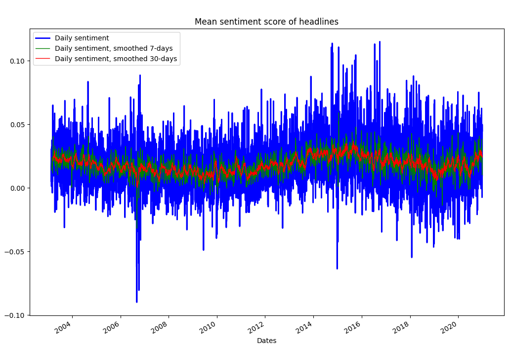

<!-- PROJECT LOGO -->
<br />
<p align="center">
  <a href="https://github.com/emiltj/cds-language-exam">
    
  </a>
  
  <h2 align="center">Sentiment analysis</h2>

  <p align="center">
    Assignment 3
    <br />
    <a href="https://github.com/emiltj/cds-language-exam/issues">Report Bug</a>
    ·
    <a href="https://github.com/emiltj/cds-language-exam/issues">Request Feature</a>
  </p>
</p>

<!-- TABLE OF CONTENTS -->
<details open="open">
  <summary>Table of Contents</summary>
  <ol>
    <li><a href="#assignment-description">Assignment description</a></li>
    <li><a href="#methods">Methods</a></li>
    <li><a href="#results-and-discussion">Results and discussion</a></li>
    <li><a href="#usage">Usage</a></li>
          <ul>
        <li><a href="#optional-arguments">Optional arguments</a></li>
      </ul>
    <li><a href="#contact">Contact</a></li>
  </ol>
</details>

<!-- ASSIGNMENT DESCRIPTION -->
## Assignment description

Use the dataset ["A million headlines"](https://www.kaggle.com/therohk/million-headlines) - headlines from the Australian news source ABC (Start Date: 2003-02-19 ; End Date: 2020-12-31).

Do the following:
* Calculate the sentiment score for every headline in the data. You can do this using the spaCyTextBlob approach that we covered in class or any other dictionary-based approach in Python.
* Create and save a plot of sentiment over time with a 1-week rolling average
* Create and save a plot of sentiment over time with a 1-month rolling average
* Make sure that you have clear values on the x-axis and that you include the following: a plot title; labels for the x and y axes; and a legend for the plot
* Write a short summary (no more than a paragraph) describing what the two plots show. You should mention the following points: 1) What (if any) are the general trends? 2) What (if any) inferences might you draw from them?

<!-- METHODS -->
## Methods

**Specifically for this assignment:**

The script first converts the dates to datetime format and then calculates the sentiment scores for each of the headlines. To calculate sentiment scores, I use the SpaCy model [en_core_web_sm](https://spacy.io/usage/models). Sentiment analysis using this approach not only rates sentences as being positive or negative, but actually applies scores based on the structure and wording of the sentence. It takes into account the word dependecies, as well as intensifiers that may strengthen the sentiment of a given word - i.e. given stronger negative score for "I am _very_ angry" as opposed to "I am angry", although the word "very" is neutrally charged by itself (read more [here](https://spacy.io/universe/project/spacy-textblob)).
After calculating the sentiment scores they are then averaged for each day. The signal of averaged sentiment scores is quite noisy and it can be hard to discern any long term low frequency patterns. By smoothing or applying a low-pass filter, we filter away the high frequency oscillations of the signal. This allows for better seeing the more general, long ranging patterns of the data. With this as rationale, the daily sentiment scores are smoothed using moving averaging, by applying rolling windows of window sizes 7 and 30 (weekly and monthly smoothing). For creating the plots, I used matplotlib and included plots on the scores for each day both smoothed and unsmoothed. I also chose to have a plot of all 4 subplots in a single plot to provide a clear overview of the increase in interpretability that smoothing can enable.

**On a more general level (this applies to all assignments):**

I have tried to as accessible and user-friendly as possible. This has been attempted by the use of:
* Smaller functions. These are intended to solve the sub-tasks of the assignment. This is meant to improve readability of the script, as well as simplifying the use of the script.
* Information prints. Information is printed to the terminal to allow the user to know what is being processed in the background
* Argparsing. Arguments that let the user determine the behaviour and paths of the script (see <a href="#optional-arguments">"Optional arguments"</a> section for more information)

<!-- RESULTS AND DISCUSSION -->
## Results and discussion

<p align="center"><a href="https://github.com/emiltj/cds-language-exam/blob/main/assignment_3/out/sentiment_scores.png"></a></p>
<p align="center"><em>Sentiment scores over time, no smoothing</em><p/>

When looking at the sentiment scores of the ABC news articles it can be hard to find any general patterns due to the great fluctuation that is apparent on a daily basis. To be able to discern any patterns, we need to extract information from the noisy signal by attenuating the higher frequency components of this signal.

<p align="center"><a href="https://github.com/emiltj/cds-language-exam/blob/main/assignment_3/out/sentiment_scores_weekly_smooth.png""></a>
<p align="center"><em>Sentiment scores over time, 7-day smoothing </em><p/>

Looking at the signal once smoothed with the 7-days moving averaging window, some trends seem to be discernable; spike in positivity around 2015-16 and a drop around 2019.

<p align="center"><a href="https://github.com/emiltj/cds-language-exam/blob/main/assignment_3/out/sentiment_scores_monthly_smooth.png"></a></p>
<p align="center"><em>Sentiment scores over time, 30-day smoothing</em><p/>

Looking at the smoothed signal once smoothed over a 30-day period, the trend described above seem to be even easier to see. Do note that the values on the y-axis also change, due to outliers having less of a say when averaging across this many days.

<p align="center"><a href="https://github.com/emiltj/cds-language-exam/blob/main/assignment_3/out/sentiment_scores_combined.png"></a></p>
<p align="center"><em>Sentiment scores over time, combined</em><p/>

In general, when looking at the smoothed signal, we can start to detect low-frequency patterns in the oscillations as the higher frequencies are attenuated.  
It can be hard to make any inferences as to what might have caused the spike in positivity around the year 2015-16 and similarly also hard to explain the drops around the year 2010 as many factors play in. However, given the horrible bush fires that killed hundreds of people and occurred in late 2019 and early 2020 it does not come as a surprise that there is a large drop in positive sentiment in the news articles in the Australian news around that time.

<!-- USAGE -->
## Usage

Make sure to follow the instructions in the README.md located at the parent level of this repository, for the required installation of the virtual environment as well as the data download.

Subsequently, use the following code (when within the ```cds-language-exam``` folder):

```bash
cd assignment_3
source ../lang101/bin/activate # If not already activated
python sentiment.py
```

### Optional arguments:

image_search.py arguments for commandline to consider:
-       '-i',
        '--inputpath',
        type = str,
        default = os.path.join("data", "abcnews-date-text.csv"),
        required = False,
        help = f"str - path to .csv. n")
-       '-t',
        '--test',
        type = bool,
        default = False,
        required = False,
        help = 'bool - if True, then performs only on a subset. False is on the full dataset')

<!-- CONTACT -->
## Contact

Feel free to write me, Emil Jessen for any questions.
You can do so on [Slack](https://app.slack.com/client/T01908QBS9X/D01A1LFRDE0) or on [Facebook](https://www.facebook.com/emil.t.jessen/).
