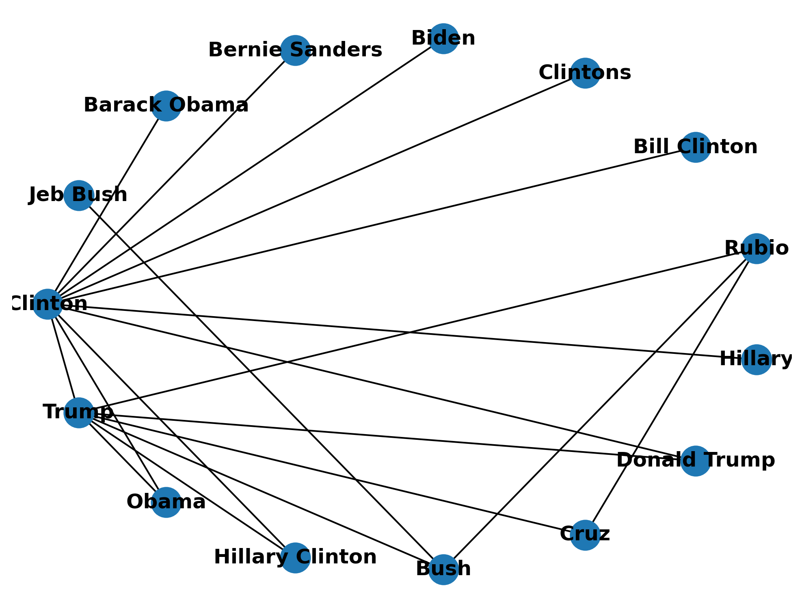

<!-- PROJECT LOGO -->
<br />
<p align="center">
  <a href="https://github.com/emiltj/cds-language-exam">
    
  </a>
  
  <h2 align="center">Network analysis</h2>

  <p align="center">
    Assignment 4
    <br />
    <a href="https://github.com/emiltj/cds-language-exam/issues">Report Bug</a>
    ·
    <a href="https://github.com/emiltj/cds-language-exam/issues">Request Feature</a>
  </p>
</p>

<!-- TABLE OF CONTENTS -->
<details open="open">
  <summary>Table of Contents</summary>
  <ol>
    <li><a href="#assignment-description">Assignment description</a></li>
    <li><a href="#methods">Methods</a></li>
    <li><a href="#results-and-discussion">Results and discussion</a></li>
    <li><a href="#usage">Usage</a></li>
          <ul>
        <li><a href="#optional-arguments">Optional arguments</a></li>
      </ul>
    <li><a href="#contact">Contact</a></li>
  </ol>
</details>

<!-- ASSIGNMENT DESCRIPTION -->
## Assignment description
This command-line tool will take a given dataset and perform simple network analysis. In particular, it will build networks based on entities appearing together in the same documents, like we did in class.

Your script should be able to be run from the command line
It should take any weighted edgelist as an input, providing that edgelist is saved as a CSV with the column headers "nodeA", "nodeB"
For any given weighted edgelist given as an input, your script should be used to create a network visualization, which will be saved in a folder called viz.
It should also create a data frame showing the degree, betweenness, and eigenvector centrality for each node. It should save this as a CSV in a folder called output.

* Your script should be able to be run from the command line
* It should take any weighted edgelist as an input, providing that edgelist is saved as a CSV with the column headers "nodeA", "nodeB"
* For any given weighted edgelist given as an input, your script should be used to create a network visualization, which will be saved in a folder called viz.
* It should also create a data frame showing the degree, betweenness, and eigenvector centrality for each node. It should save this as a CSV in a folder called output.

<!-- METHODS -->
## Methods

**Specifically for this assignment:**
A prerequisite for completing this assignment is having a weighted edgelist. I have therefore decided to include an additional script, which generates a weighted edgelist (```create_edgelist.py```). This script takes the ```fake_or_real_news.csv``` dataset and extracts its entities with the label \[PERSON\]. It utilizes the model _en_core_web_sm_ from the SpaCy library. It then find entity pairs (entities that appear within the same document) and counts how often these pairs have appeared in all news articles - these counts are the weight of each of the unique pairs. The weighted edgelist is then saved as a .csv.

The actual assignment script ```network.py``` takes the newly created weighted edgelist as input and the argument _n_ that specifies how many of the heighest weighted node pairs the network analysis should include. It plots the network using the package _networkx_ and saves it to directory ```viz```. It also calculates centrality measures and saves it as a .csv in the folder  ```output```. The measures are eigenvector centrality, betweenness centrality and degree centrality. Eigenvector centrality is a measure of influence of a node - nodes with many connections to other well connected nodes will have higher scores. Betweenness centrality is a measure of centrality in a network - a node that lies on communication flows can control the flow. Calculated by computing the shortest paths between all nodes, then determining the fraction of the number of these paths that go through a given node in question, compared to total number of paths. In a weighted network such as this one, scores are higher given higher edge weights. Degree centrality is merely the number of connections a given node has.

**On a more general level (this applies to all assignments):**
I have tried to as accessible and user-friendly as possible. This has been attempted by the use of:
* Smaller functions. These are intended to solve the sub-tasks of the assignment. This is meant to improve readability of the script, as well as simplifying the use of the script.
* Information prints. Information is printed to the terminal to allow the user to know what is being processed in the background
* Argparsing. Arguments that let the user determine the behaviour and paths of the script (see <a href="#optional-arguments">"Optional arguments"</a> section for more information)

<!-- RESULTS AND DISCUSSION -->
## Results and discussion

**Creating an edgelist:**
|    |                    |                 |        | 
|----|--------------------|-----------------|--------| 
|    | nodeA              | nodeB           | weight | 
| 0  | John F. Kerry      | Kerry           | 21     | 
| 1  | John F. Kerry      | Laurent Fabius  | 2      | 
| 2  | Francois Hollande  | John F. Kerry   | 1      | 
| 3  | John F. Kerry      | Obama           | 76     | 
| 4  | Benjamin Netanyahu | John F. Kerry   | 7      | 
| 5  | Jane Hartley       | John F. Kerry   | 1      | 

<em>Excerpt from the generated edgelist</em>

As can be seen in the table above, the script for generating weighted edgelists has been sucessfully in that it indeed has created a weighted edgelist. The entity extraction of people has correctly both identified John F. Kerry and Kerry as entities. As can be seen in the table however, the script was not programmed to merge entities referring to the save person into a single entity, i.e. changing "Kerry" into "John F. Kerry" to avoid the problem we see above. Additional processing ought to have been carried out to circumvent this problem.

**Network analysis:**
<p align="center"><a href="https://github.com/emiltj/cds-language-exam/blob/main/assignment_4/out/viz/network_visualization.png"></a></p>
<p align="center"><em>The network visualized (showing the 15 heighest weighted connections)</em><p/>

When looking at the visualization of the network of the 15 strongest connections, it appears that Hillary Clinton, Barack Obama and Donald Trump have some of the strongest connections. However, it should of course be noted that a large portion of strong connections are, in fact, to themselves. This is a result of the edgelist used as input. Otherwise, the script seems to produce the desired outcome.

|    |                 |                        |                        |                     | 
|----|-----------------|------------------------|------------------------|---------------------| 
|    | node            | eigenvector_centrality | betweenness_centrality | degree_centrality   | 
| 0  | Clinton         | 0.5276992157079976     | 0.7087912087912088     | 0.8571428571428571  | 
| 1  | Trump           | 0.5359784095931499     | 0.4670329670329671     | 0.6428571428571428  | 
| 2  | Obama           | 0.2877321039031794     | 0.0                    | 0.2857142857142857  | 
| 3  | Hillary Clinton | 0.22647028527916035    | 0.0                    | 0.14285714285714285 | 
| 4  | Bush            | 0.23017534121767486    | 0.14285714285714288    | 0.3571428571428571  | 

<p align="center"><em>Excerpt from the centrality measures output</em><p/>

As can be seen in the table above, the problem identified in the creation of the edgelist leaks through - when looking at the excerpt Clinton appears twice. Does Clinton refer to Bill Clinton or Hillary? Or perhaps sometimes Bill and other times Hillary? We cannot know for sure. Regardless when looking at eigenvector centrality, it seems that Trump and Clinton have many connections to other highly connected people. When looking at betweenness centrality, it appears that Clinton functions as a link between a lot of other nodes, glueing many people together. When looking at degree centrality - sheer number of connections, Clinton and Trump appears at the clear top.

Important to note though; the short summary of the results here are merely on the basis of the small excerpt for reasons of simplicity. It is also worthwhile mentioning that the exact scores are not to be trusted too much, due to the same people appearing as multiple nodes (e.g. Clinton, Hillary Clinton, etc.). The script producing this table, seems to work according to the desired outcome although another edgelist would have been desired.

<!-- USAGE -->
## Usage

Make sure to follow the instructions in the README.md located at the parent level of this repository, for the required installation of the virtual environment as well as the data download.

Subsequently, use the following code (when within the ```cds-language-exam``` folder):

```bash
cd assignment_4
source ../lang101/bin/activate # If not already activated
python create_edgelist.py
python network.py
```

### Optional arguments:

create_edgelist.py arguments for commandline to consider:
-       '-i',
        '--inpath',
        type = str, 
        default = os.path.join("data", "fake_or_real_news.csv"), # Default when not specifying a path
        required = False,
        help = "Inputpath for generating edgelist")

network.py arguments for commandline to consider:
-       "-i",
        "--inpath", 
        type = str,
        default = os.path.join("out","weighted_edgelist.csv"), # Default when not specifying a path
        required = False, # Since we have a default value, it is not required to specify this argument
        help = "str containing path to edgelist file")
-       "-n",
        "--n", 
        type = int,
        default = 25, # Default when not specifying anything in the terminal
        required = False, # Since we have a default value, it is not required to specify this argument
        help = "int specifying number of node + edge pairs wanted in the analysis (top n weighted pairs)")

<!-- CONTACT -->
## Contact

Feel free to write me, Emil Jessen for any questions.
You can do so on [Slack](https://app.slack.com/client/T01908QBS9X/D01A1LFRDE0) or on [Facebook](https://www.facebook.com/emil.t.jessen/).
