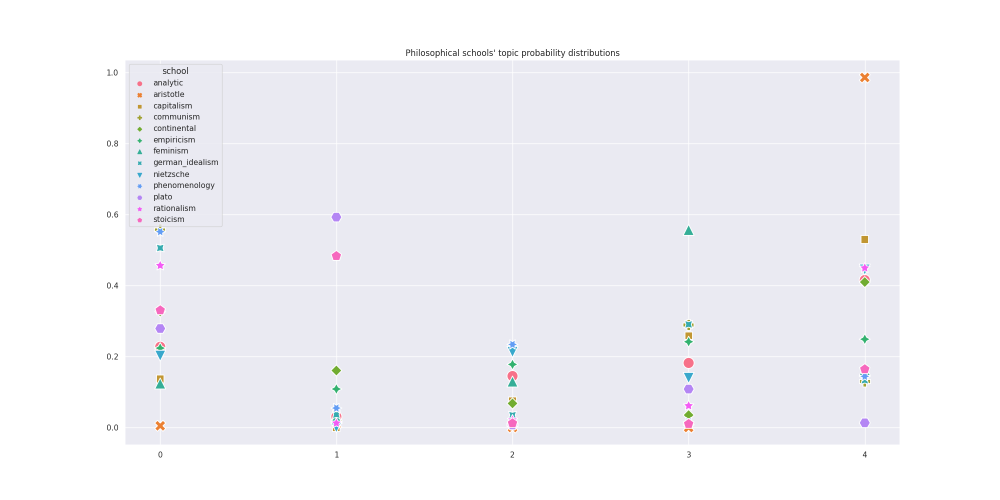
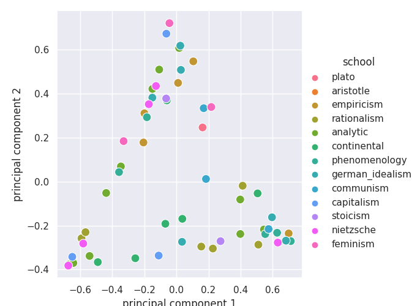
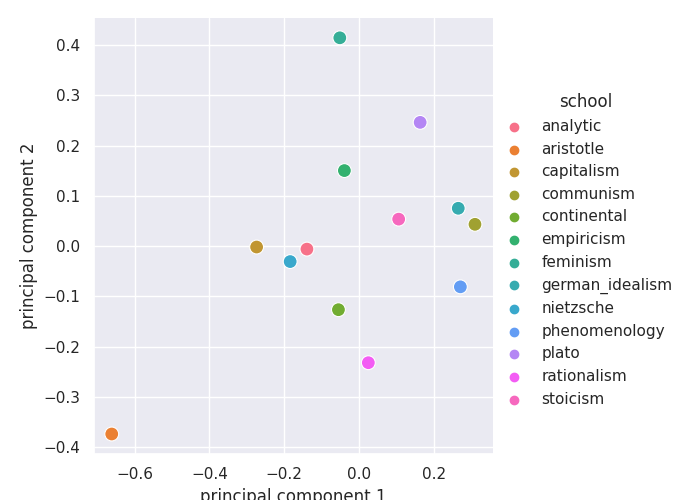
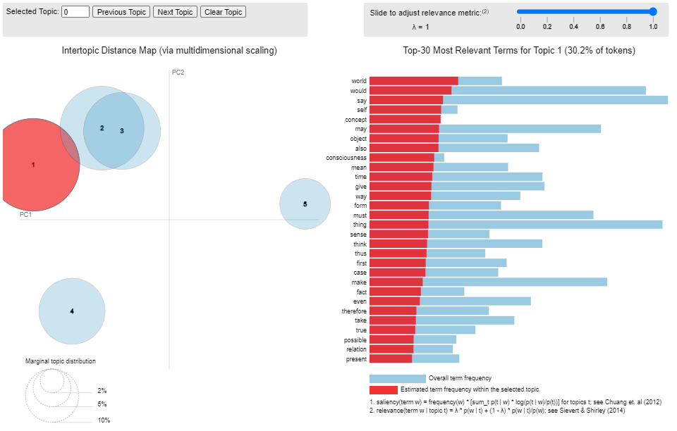

<!-- PROJECT LOGO -->
<br />
<p align="center">
  <a href="https://github.com/emiltj/cds-language-exam">
    
  </a>
  
  <h2 align="center">(Un)supervised machine learning - LDA and Topic modeling on philosophical texts</h2>

  <p align="center">
    Assignment 5
    <br />
    <a href="https://github.com/emiltj/cds-language-exam/issues">Report Bug</a>
    ·
    <a href="https://github.com/emiltj/cds-language-exam/issues">Request Feature</a>
  </p>
</p>

<!-- TABLE OF CONTENTS -->
<details open="open">
  <summary>Table of Contents</summary>
  <ol>
    <li><a href="#assignment-description">Assignment description</a></li>
    <li><a href="#methods">Methods</a></li>
    <li><a href="#results-and-discussion">Results and discussion</a></li>
    <li><a href="#usage">Usage</a></li>
          <ul>
        <li><a href="#optional-arguments">Optional arguments</a></li>
      </ul>
    <li><a href="#contact">Contact</a></li>
  </ol>
</details>

<!-- ASSIGNMENT DESCRIPTION -->
## Assignment description
### General assignment description
_Pick your own dataset to study.
Train an LDA model on your data to extract structured information that can provide insight into your data. For example, maybe you are interested in seeing how different authors cluster together or how concepts change over time in this dataset. You should formulate a short research statement explaining why you have chosen this dataset and what you hope to investigate. This only needs to be a paragraph or two long and should be included as a README file along with the code. E.g.: I chose this dataset because I am interested in... I wanted to see if it was possible to predict X for this corpus. You should also include a couple of paragraphs in the README on the results, so that a reader can make sense of it all. E.g.: I wanted to study if it was possible to predict X. The most successful model I trained had a weighted accuracy of 0.6, implying that it is not possible to predict X from the text content alone. And so on._

_Tips_

* _Think carefully about the kind of preprocessing steps your text data may require - and document these decisions!_
* _Your choice of data will (or should) dictate the task you choose - that is to say, some data are clearly more suited to supervised than unsupervised learning and vice versa. * Make sure you use an appropriate method for the data and for the question you want to answer_
* _Your peer reviewer needs to see how you came to your results - they don't strictly speaking need lots of fancy command line arguments set up using argparse(). You should still try to have well-structured code, of course, but you can focus less on having a fully-featured command line tool_

### My assignment description
This assignment seeks to use Latent Dirichlet Analysis (LDA) as a tool of topic modeling. It investigate historical philosophical texts from different schools of philosophical thought in an exploratory manner. More specifically, it seeks to investigate whether particular schools of philosophical have similarities in terms of topics - e.g. _Do texts from German Idealism incorporate the same topics as Nietzsches texts?_ and _Do old Greek philosophical schools cluster together in terms of topics?_

Moreover, to dig a little bit deeper than entire schools as a whole, I also want to do the same type of investigation into the individual books of the different philosophical schools (not limiting this exploratory project to just looking at texts from schools as a homogeneous group).

* Merge paragraphs from the same books together in the philosophical text corpus.
* Perform LDA, using bigram and trigram models. Ensure that the LDA utilizes K=5 topics
* Create a visualization that depicts each philosophical schools' respective topic prevalence.
* Reduce the 5-dimensional topic space to 2 dimensions using Principal Component Analysis (PCA)
* Plot the schools in this PCA-space (with X and Y axes showing principal component 1 and 2, respectively)
* Plot the individual books in this PCA-space (with X and Y axes showing principal component 1 and 2, respectively)

<!-- METHODS -->
## Methods

**Specifically for this assignment:**

For this assignment, I first aggregated all entries from the same book title together, to have the entire text of one book as one entry. I wanted to look at individual books for my visualizations. I then built bigram and trigram models which would find contiguous sequences of 2 or 3 items (phrases of 2 or 3 words). The models had a threshold score of 100, which meant that they would only allow phrases if the score of the phrase was greater than the threshold. Using the models, I processed the entries (i.e. books), only keeping nouns. I then created a dictionary so I could convert the processed data into vectors. A word in an entry would then be converted into an integer value (with the value functioning like an ID for the dictionary).
Using the processed corpus I built an LDA model with a default of K=5 topics . As the number of topics is mostly an arbitrary choice, I let the user be enabled to specify another number, using the argument --ntopics. A perplexity score (a statistical measure of how well the model predicts a sample) and a coherence score (measure of the degree of semantic similarity between high scoring words in the topic) are printed to the terminal upon running the script. The prevalences of the topics are then computed for each book title. 
These prevalence scores for each book title are then used to create a plot.
- PCA is utilized to reduce the K dimensions (number of topics - 5 as default) to 2 dimensions, in order to plot the books in PCA-space. They are here colored by the respective school of philosophical thought.

The topic prevalences of all books from the same philosophical school are then averaged together, to get a simplistic measure of topic prevalence in each philosophical school.

- A plot is created that show the topic prevalence distribution across schools of philosophical thought. 
- Again, PCA is utilized to reduce the K (5 as default) dimensions (from K topics) to 2 dimensions in order to plot the different schools in PCA-space. 

Finally, I also saved an interactive HTML document that shows the intertopic distance also using PCA. This also gives lists of the most important words for each topic.

**On a more general level (this applies to all assignments):**

I have tried to as accessible and user-friendly as possible. This has been attempted by the use of:
* Smaller functions. These are intended to solve the sub-tasks of the assignment. This is meant to improve readability of the script, as well as simplifying the use of the script.
* Information prints. Information is printed to the terminal to allow the user to know what is being processed in the background
* Argparsing. Arguments that let the user determine the behaviour and paths of the script (see <a href="#optional-arguments">"Optional arguments"</a> section for more information)

<!-- RESULTS AND DISCUSSION -->
## Results and discussion
Given the exploratory nature of this assignment few quantitative results have been generated. As a consequence, this section will provide an overview and interpretation of the visual output.

Please do note that this section looks at the results for K = 5. As performance metrics can be compared across different K's (numbers of topics) using the argument, one may  want to experiment finding the optimal number of topics.

**Topic prevalence in schools of philosophical thought**
<p align="center">
<a href="https://github.com/emiltj/cds-language-exam/blob/main/assignment_5/out/plot_topic_prob.png">
<em> 
Plot showing the topic prevalence of the different schools of philosophical thought
</em>
</a>


When looking at the schools' topic prevalences the first thing that comes up is the high prevalence of topic 1 in the school of Aristotle and Empiricism. Stoicms and Plato seems to be unrelated to most topics, say for topic 4 and 3, respectively.

**PCA visualizations of schools of philosophical thought**

<p align="center"><a href="https://github.com/emiltj/cds-language-exam/blob/main/assignment_5/out/pca_schools.png"></a>   <a href="https://github.com/emiltj/cds-language-exam/blob/main/assignment_5/out/pca_schools_agg.png"></a></p>
<p align="center"><em>Left: Plot of title topic prevalence (projected onto a 2D PCA space). Colored by school of thought. </em><p/> <p align="center"><em>Right: Plot of the mean topic prevalence for titles within a philosophical school (projected onto 2D PCA space)</em><p/>

When plotting the different book titles' intertopic distance, we can see that there seem to be some clustering going on. A lot of texts appear at the bottom and perhaps especially at the far left and at the right. There doesn't seem to be any clearcut clustering of the texts of the same school, which may lead us to believe that the topic prevalence doesn't fully correlate with school of thought.

When plotting the different schools' intertopic distance (grouped by mean scores of each school) interesting relations become evident. Aristole and Empricism seem to have a low distance between the two, which makes sense when also taking into account the similiarities in the [plot over the topic prevalence in schools of philosophical thought](https://github.com/emiltj/cds-language-exam/blob/main/assignment_5/out/plot_topic_prob.png).

**LDA html output**

<p align="center">
  <a href="https://github.com/emiltj/cds-language-exam/blob/main/assignment_5/out/LDA_html_screenshot.png">
</a>
<p align="center">
  <em> 
  Screenshot of the html showing which words make up the topics. NOTE: The topics are ordered by presence in the data which means that 1 does not cross-correspond to the previous plots.
  </em>
</a>

The LDA html output provides information on which topics are most prevalent (size of circles) and also which words are most deemed most important for the topic (words on the right). Opening the file in your favorite editor would allow you interact, by pointing your mouse to a given topic. Please note that this plot have the topics ordered by presence in the data which means that 1 does not cross-correspond to the previous plots.

<!-- USAGE -->
## Usage

Make sure to follow the instructions in the README.md located at the parent level of this repository, for the required installation of the virtual environment as well as the data download.

Subsequently, use the following code (when within the ```cds-language-exam``` folder):

```bash
cd assignment_5
source ../lang101/bin/activate # If not already activated
python topic_modeling_philosophy.py
```

### Optional arguments:

topic_modeling_philosophy.py arguments for commandline to consider:
-       "-i",
        "--inpath", 
        type = str,
        default = os.path.join("data", "philosophy_data.csv"), # Default path to data
        required = False,
        help= "str - path to image corpus")
-       "-t",
        "--test", 
        type = bool,
        default = False,
        required = False,
        help= "bool - specifying whether to run a test on a subset of 50000 randomly sampled entries or on the full dataset")

<!-- CONTACT -->
## Contact

Feel free to write me, Emil Jessen for any questions.
You can do so on [Slack](https://app.slack.com/client/T01908QBS9X/D01A1LFRDE0) or on [Facebook](https://www.facebook.com/emil.t.jessen/).
