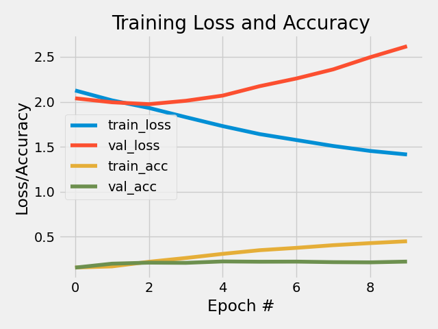

<!-- PROJECT LOGO -->
<br />
<p align="center">
  <a href="https://github.com/emiltj/cds-language-exam">
    
  </a>
  
  <h2 align="center">Text classification using Deep Learning</h2>

  <p align="center">
    Assignment 6
    <br />
    <a href="https://github.com/emiltj/cds-language-exam/issues">Report Bug</a>
    ·
    <a href="https://github.com/emiltj/cds-language-exam/issues">Request Feature</a>
  </p>
</p>

<!-- TABLE OF CONTENTS -->
<details open="open">
  <summary>Table of Contents</summary>
  <ol>
    <li><a href="#assignment-description">Assignment description</a></li>
    <li><a href="#methods">Methods</a></li>
    <li><a href="#results-and-discussion">Results and discussion</a></li>
    <li><a href="#usage">Usage</a></li>
          <ul>
        <li><a href="#optional-arguments">Optional arguments</a></li>
      </ul>
    <li><a href="#contact">Contact</a></li>
  </ol>
</details>

<!-- ASSIGNMENT DESCRIPTION -->
## Assignment description
_Winter is... hopefully over._

In class this week, we've seen how deep learning models like CNNs can be used for text classification purposes. For your assignment this week, I want you to see how successfully you can use these kind of models to classify a specific kind of cultural data - scripts from the TV series Game of Thrones.

You can find the data [here](https://www.kaggle.com/albenft/game-of-thrones-script-all-seasons).

In particular, I want you to see how accurately you can model the relationship between each season and the lines spoken. That is to say - can you predict which season a line comes from? Or to phrase that another way, is dialogue a good predictor of season?
* Start by making a baseline using a 'classical' ML solution such as CountVectorization + LogisticRegression and use this as a means of evaluating how well your model performs.
* Then you should try to come up with a solution which uses a DL model, such as the CNNs we went over in class.

<!-- METHODS -->
## Methods

**Specifically for this assignment:**

For the Logistic Regression (LR) classification task, I start by loading in the dialogue from Game of Thrones. I then do a stratified train-test split of the data, as the data set is unbalanced. Stratification locks the distribution of classes in the train and test sets - i.e. if season 1 entries account for 23% of the entire dataset, then both the train and test set will also consist of 23% data from season 1. The dialogue is then vectorized. The sentences are converted to vectors as LR only take vectors as input. Each number in the vectors represent a word index in a vocabulary list (which links the integer to the corresponding string). The feature vectors and the labels from the training data are then used to train the LR classifer - a model which is subsequently tested on the test split. A classification matrix is saved a long with a confusion matrix to the folder ```out``` .

For the Convolutional Neural Networks (CNN) classification task, the data is split in a similar fashion to the LR using stratification. The sentences are then converted to vectors as to prepare them as input for the CNN. All feature vectors are then padded with 0's until the reach the vector length of the longest vector so as to have the same length. The labels are then binarized using sklearn's LabelBinarizer() and an embedding matrix is create using one either the 50D or 100D Glove models - which one can be specified through the use of the argument --glovedim (for more information on the Glove models, see [here](https://nlp.stanford.edu/projects/glove/)). After the embedding is created, I define a sequential model using keras and here use the embedding matrix to create an embedding layer as the first layer. The layer is then succeeded by a convolutional layer with ReLU activation, followed by a max pooling layer and two fully connected network layers. The model is then trained on the training data and tested on the test data. Using the predictions a classification matrix is saved to the folder ```out```.

It is worth noting that when tuning either the c-parameter in the LR classifier or the layers in the CNN, such as has been done here, we risk overfitting to the testing data. Given enough data, it is generally advisable to include a hold out set - another test set that is only to be tested on when parameters have been tuned to maximum performance on the test set. These scripts do include a holdout set and the results ought to be scrutinized accordingly.

**On a more general level (this applies to all assignments):**

I have tried to as accessible and user-friendly as possible. This has been attempted by the use of:

* Smaller functions. These are intended to solve the sub-tasks of the assignment. This is meant to improve readability of the script, as well as simplifying the use of the script.
* Information prints. Information is printed to the terminal to allow the user to know what is being processed in the background
* Argparsing. Arguments that let the user determine the behaviour and paths of the script (see "Optional arguments" section for more information)

<!-- RESULTS AND DISCUSSION -->
## Results and discussion

Although accuracy is often in the focus when evaluating machine learning classification performance, I choose to focus on F1-scores as the harmonic mean between recall and precision provide a metric that is less likely to be misinterpreted. Using accuracy as a metric for the combined classification performance in an unbalanced dataset such as this would not accurately convey the performance of the model, as classes with more data would be weighed as more important when taking the accuracy score at face value.

**Logistic Regression classification:**

|           |                     |                     |                     |                     |                     |                     |                     |                     |                    |                     |                    | 
|-----------|---------------------|---------------------|---------------------|---------------------|---------------------|---------------------|---------------------|---------------------|--------------------|---------------------|--------------------| 
|           | Season 1            | Season 2            | Season 3            | Season 4            | Season 5            | Season 6            | Season 7            | Season 8            | accuracy           | macro avg           | weighted avg       | 
| precision | 0.29 | 0.27 | 0.24 | 0.26 | 0.25  | 0.33 | 0.39  | 0.25 | 0.28 | 0.28 | 0.28 | 
| recall    | 0.31 | 0.37  | 0.26  | 0.29 | 0.24 | 0.24 | 0.29 | 0.09 | 0.28 | 0.26 | 0.28 | 
| f1-score  | 0.30  | 0.31  | 0.25                | 0.27 | 0.25 | 0.28  | 0.33   | 0.13 | 0.28 | 0.27  | 0.27 | 
| support   | 477.0               | 587.0               | 536.0               | 517.0               | 455.0               | 429.0               | 366.0               | 220.0               | 0.28 | 3587.0              | 3587.0             | 

The LR model performs with an average macro F1-score of 0.27 and seems to predict some seasons better than others. The F1-score for season 8 is at 0.13, which shows that the model had difficulties with predictions here. When looking at the precision and recall it becomes apparent that the model misplaced many season 8 quotes as belonging to other seasons. On the contrary, of those few that were actually classified as season 8 a relatively large portion was actually classified as coming from season 8. The support score for this season is significantly lower than for the other classes. This all points in the direction that the model learned that it achieved a higher performance by classifying only the quotes that it was very confident belonged to season 8, as season 8. This is due to the fact that so few quotes actually were from season 8.

**Convolutional Neural Networks classification:**

|           |                     |                     |                     |                     |                     |                     |                     |                     |                     |                     |                     | 
|-----------|---------------------|---------------------|---------------------|---------------------|---------------------|---------------------|---------------------|---------------------|---------------------|---------------------|---------------------| 
|           | Season 1            | Season 2            | Season 3            | Season 4            | Season 5            | Season 6            | Season 7            | Season 8            | accuracy            | macro avg           | weighted avg        | 
| precision | 0.33 | 0.26 | 0.23 | 0.18  | 0.16 | 0.22 | 0.22 | 0.18 | 0.22 | 0.22 | 0.23 | 
| recall    | 0.34 | 0.27  | 0.14  | 0.36 | 0.13 | 0.08 | 0.32 | 0.09 | 0.22 | 0.21 | 0.22 | 
| f1-score  | 0.33  | 0.26  | 0.17 | 0.24  | 0.14  | 0.12 | 0.26  | 0.12 | 0.22 | 0.21 | 0.21 | 
| support   | 477.0               | 587.0               | 536.0               | 517.0               | 455.0               | 429.0               | 366.0               | 220.0               | 0.22 | 3587.0              | 3587.0              | 

The CNN model perform notably worse than the LR model with a macro average F1-score of 0.21. In general deep neural networks tend to perform better that logistic regressions, given optimal layer architecture, enough data and enough training. However, in this case we see the LR model outperforming the CNN model. Why might this be? Utilizing the embedding that only excludes certain word types result in the model not being able to learn patterns that might be prevalent in these word types. It might be that the words excluded carried important information in distinguishing between seasons. 

Another reason for the low performance may be related to overfitting of the model. When looking at the training history, it becomes evident that validation and training accuracy started to diverge after only a few epochs. If the model architecture had included either a dropout layer or some regularization, the overfitting may had been less of an issue.

<p align="center">
<a href="https://github.com/emiltj/cds-language-exam/blob/main/assignment_6/out/cnn_training_history.png">

</a>
<em>Training history of the CNN model</em>

<!-- USAGE -->
## Usage

Make sure to follow the instructions in the README.md located at the parent level of this repository, for the required installation of the virtual environment as well as the data download.

Subsequently, use the following code (when within the ```cds-language-exam``` folder):

```bash
cd assignment_6
source ../lang101/bin/activate # If not already activated
python lr_got.py
python cnn_got.py
```

### Optional arguments:

lr_got.py arguments for commandline to consider:
-       "-i",
        "--inpath", 
        type = str,
        default = os.path.join("data", "Game_of_Thrones_Script.csv"),
        required = False,
        help = "str - specifying inpath to Game of Thrones script")
-       "-C",
        "--C", 
        type = int,
        default = 1,
        required = False,
        help = "int - specifying c parameter for the model")

cnn_got.py arguments for commandline to consider:
-       "-i",
        "--inpath", 
        type = str,
        default = os.path.join("data", "Game_of_Thrones_Script.csv"),
        required = False,
        help= "str - specifying inpath to Game of Thrones script")
-       "-e",
        "--epoch", 
        type = int,
        default = 10,
        required = False,
        help= "int - specifying number of epochs for the cnn model training")
-       "-b",
        "--batchsize",
        type = int, 
        default = 100,
        required = False,
        help = "int - specifying batch size")
-       "-g",
        "--glovedim", 
        type = int,
        default = 50,
        required = False,
        help= "int - specifying which how many dimensions should be in the glove embedding to use. Options: 50 or 100")
-       "-E",
        "--embeddingdim", 
        type = int,
        default = 50,
        required = False,
        help= "int - specifying dimensions for the embedding")

<!-- CONTACT -->
## Contact

Feel free to write me, Emil Jessen for any questions.
You can do so on [Slack](https://app.slack.com/client/T01908QBS9X/D01A1LFRDE0) or on [Facebook](https://www.facebook.com/emil.t.jessen/).
