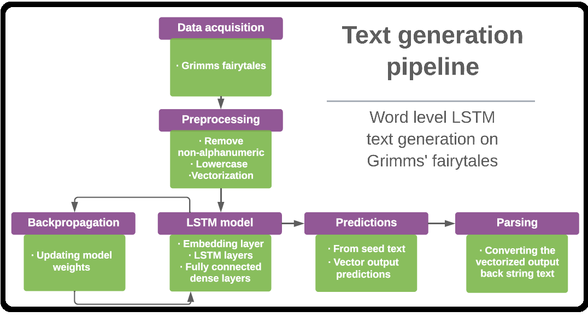
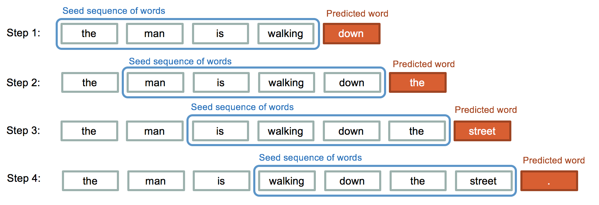
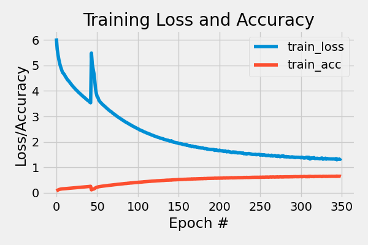

<!-- PROJECT LOGO -->
<br />
<p align="center">
  <a href="https://github.com/emiltj/cds-language-exam">
    
  </a>
  
  <h2 align="center">LSTM models for text generation</h2>

  <p align="center">
    Assignment 7
    <br />
    <a href="https://github.com/emiltj/cds-language-exam/issues">Report Bug</a>
    ·
    <a href="https://github.com/emiltj/cds-language-exam/issues">Request Feature</a>
  </p><
</p>

<!-- TABLE OF CONTENTS -->
<details open="open">
  <summary>Table of Contents</summary>
  <ol>
    <li><a href="#assignment-description">Assignment description</a></li>
    <li><a href="#methods">Methods</a></li>
    <li><a href="#results-and-discussion">Results and discussion</a></li>
    <li><a href="#usage">Usage</a></li>
          <ul>
        <li><a href="#optional-arguments">Optional arguments</a></li>
      </ul>
    <li><a href="#contact">Contact</a></li>
  </ol>
</details>

<!-- ASSIGNMENT DESCRIPTION -->
## Assignment description

This assignment seeks to generative new textual content by implementing a Recurrent Neural Network (RNN). More specifically, this assignment seeks see whether it is possible to generate new textual content in line with the text from [the corpus](https://www.kaggle.com/tschomacker/grimms-fairy-tales) of folklore fairy tales written by the Brothers Grimm (Jacob Ludwig Karl Grimm and Wilhelm Carl Grimm). The project intends to investigate the questions: _How well can a neural network learn the patterns of the writings of the Brothers Grimm?_ and _Using the trained model - is it possible to generate new textual content that could have been something you read in an old fairy tale?_

Try using a text generative approach that learns and predicts on word-level, rather than on a character-level.

* Train a Long Short-Term Memory (LTSM) artificial Recurrent Neural Network (RNN) on the corpus
* Use sequences of 50 words as input for the model
* Bonus task: include arguments that let you specify model training parameters and LTSM model architecture (LTSM layers, epochs and batch size). You might also want to specify options for the text generation - how many text chunks should be generated?

<!-- METHODS -->
## Methods

**Specifically for this assignment:**

For this assignment I started out by loading in the text corpus. The text was then preprocessed; the strings that each contained a fairy tale were appended to one long list of strings (each item in the list being one word). During preprocessing non-alphanumeric characters and linebreaks were also removed. I then defined and made use of a function retrieves word sequences using a moving window (e.g. ["once", "upon", "a", "time", "in"] becomes the sequences: [["once upon a"], ["upon a time"], ["a time in"]] when using window size = 3 and step size = 1). I chose to retrieve sequences of size 51.  The sequences were then tokenized meaning that each word was replaced by an integer and that the specific integer also functions as an ID in a saved vocabulary list. Having the text sequences as this array allow the model to train on the data. 
The first 50 words in each tokenized sequence would be used as features for the model input, while the last word in the sequence would be what the model tries to predict. The list of tokens to predict are then one-hot encoded to match the shape for a keras model that uses categorical crossentropy as loss function and softmax activation for the final layer.

<p align="center">
<a href="https://github.com/emiltj/cds-language-exam/README_images/text_generation_pipeline.png">

</a>

<p align="center"><em>Visualization of the pipeline used for text generation</em></p>

The model consists of an embedding layer followed by two LTSM layers of depth 128 and 100 as per default. Using the argument --l, one may specify another structure for the LTSM layers. The model implements LTSM layers due to their way of handling the vanishing gradient problem (the problem of shrinking gradients over time in backpropagation) that is prevalent in traditional RNNs. It does so by the use of feedback connections called gates. The LTSM layers are succeeded by a dense layer (32 nodes) and an output layer that uses softmax and has the number of nodes equal to number of possible predictions (number of unique words in the corpus).
The model is then trained on the data, learning the patterns in the sequences to be able to predict the next token that would appear after each sequence of 50 tokens. Epochs and batchsize for the model training can be determined using the arguments (see section "Optional arguments").

<p align="center">
<a href="https://github.com/emiltj/cds-language-exam/README_images/text_generative_models.png">

</a>

<p align="center"><em>Visualization of the principle behind text generation algorithms. Image from blogpost by Harsh Basnal (https://bansalh944.medium.com/text-generation-using-lstm-b6ced8629b03) </em></p>

The text generation method works by taking a sequence of tokens of the same length as the input layer (e.g. one of the sequences of 50 words that were used to train the model) and predict the next token using the trained model. This word prediction is the first token of the sequence that is to be generated. The model then uses the 49 last tokens of the input sequence plus the newly predicted token to predict the next token. And so on an so forth, until the requirements for length of the generated sequence has been met. Since the tokens all carry a unique ID, the actual words that the point to can be identified using the saved ID-word dictionary. 

The script uses the above mentioned principle to generate new sequences. It randomly samples sequences from the training data to generate the new texts. The number of generated sequences can be specified using the argument _--ngenerate_.

**On a more general level (this applies to all assignments):**

I have tried to as accessible and user-friendly as possible. This has been attempted by the use of:
* Smaller functions. These are intended to solve the sub-tasks of the assignment. This is meant to improve readability of the script, as well as simplifying the use of the script.
* Information prints. Information is printed to the terminal to allow the user to know what is being processed in the background
* Argparsing. Arguments that let the user determine the behaviour and paths of the script (see <a href="#optional-arguments">"Optional arguments"</a> section for more information)

<!-- RESULTS AND DISCUSSION -->
## Results and discussion

**Model training**

The model achieved a training accuracy of 64% - mean that more than half the of the word predictions were correct. Given the +2700 classes (unique words to predict) it can be said that the model performed quite well. Needless to say, this is certainly because the model overfit to this data, be learning patterns that are specific to this dataset. Evidently, the performance when predicting out of the training samples would drop significantly as the model would not generalize well. However, the purpose of this model was not generalize to other texts and to achieve high out-of-sample accuracies, but rather to generate texts. But did the model train enough? From looking at the plot over training accuracy and loss over epochs, it appears that the model had diminishing returns as epochs increased and more epochs would likely not have increase performance much. Although perhaps given a more complex architecture, the model have been able to perform even better on the training data given more epochs.

<p align="center">
<a href="https://github.com/emiltj/cds-language-exam/blob/main/assignment_7/out/training_hist.png">

</a>

<p align="center"><em>Training history of the model</em></p>

**Generating text**
_Insert generated text here_

_Insert generated text here_

The above word sequences are a few cherry picked results that the model ended up producing. Note that these have been manually altered by adding linebreaks, punctuation and by capitalizing letters after periods. The sentences mostly seem to apply to the rules of grammar but  kjahdslkjahdslkahsdlkjdsaasdasdasdsa. Although the generated content had some merits in terms of grammar, all semantic coherence seems to be absent. This seems to be a general issue across the different methods used to generate new text - even for esteemed experts in RNNs such as the team behind TensorFlow (see their approach [here](https://www.tensorflow.org/text/tutorials/text_generation)). At present, text generative processes seem to be mostly useful for entertainment purposes, abstract poetry, or as a means to acquire inspirational content in an atypical way.

When looking at the raw output of the script, it also becomes evident that this model lacks formatting - in terms of linebreaks and punctuation. The preprocessing of the data filtered away non-alphanumeric characters, but this may have been unnecessary. Had, for instance, periods been treated like tokens just as the words, the model may had been able to predict punctuation somewhat accurately. Pair this with linebreaks and quotation marks etc., and the output may have been better. Regex patterning could also have been applied to capitalize the first letter when following a period.


|    |                                                               |                                                                                                                                                                            | 
|----|---------------------------------------------------------------|----------------------------------------------------------------------------------------------------------------------------------------------------------------------------| 
|    | length_10                                                     | length_50                                                                                                                                                                  | 
| 0  | from whence his wealth came to see them to the                | her own child will for this then the king went shivering and looked up and saw that their hair her sister loved his bread she thought each man caused found                | 
| 1  | cried is himself give me my head then the king                | brought two far in the window and the man came with pale and diamonds equipped a thousand folk this cages loudly and as he saw a white snake lying coiled                  | 
| 2  | kitchen and shook out the willowwren flew up to his           | has supported me down into the cellar and see where my father grieved when we to eat of the sexton came to the door he leapt into the inn there                            | 
| 3  | foot and limped hobblety jib hobblety and when he came        | him joy at once the king had a great thirst and mother so she sat down by the fields and then he ran back to her grave and said what                                       | 
| 4  | and when he had gone on her she walked out                    | dead an old fox too for she began to bewail them began with gold and sleep dogs yet fiddle and then her mother should find him as he could even                            | 
| 5  | place and when he saw the bridegroom screamed out and         | after something but that you can have my thirst but happen to said the youth and was travelling dead cup to the bottom of the movements door remained a raven              | 

<!-- USAGE -->
## Usage

Make sure to follow the instructions in the README.md located at the parent level of this repository, for the required installation of the virtual environment as well as the data download.

Subsequently, use the following code (when within the ```cds-language-exam``` folder):

```bash
cd assignment_7
source ../lang101/bin/activate # If not already activated
python text_generator.py
```

### Optional arguments:

text_generator.py arguments for commandline to consider:
-       "-i",
        "--inpath", 
        type = str,
        default = os.path.join("data", "grimms_fairytales.csv"),
        required = False,
        help = "str - specifying inpath to the Grimms fairy tales")
-       "-l",
        "--ltsmlayers", 
        type = list,
        default = [128, 100],
        required = False,
        help = "list of integers - specifying number and depth of LTSM layers")
-       "-b",
        "--batchsize", 
        type = int,
        default = 64,
        required = False,
        help = "int - specifying batch size for the model training")
-       "-e",
        "--epochs", 
        type = int,
        default = 350,
        required = False,
        help = "int - specifying number of epochs for the training")
-       "-n",
        "--ngenerate", 
        type = int,
        default = 50,
        required = False,
        help = "int - specifying how many sequences the script should generate")

<!-- CONTACT -->
## Contact

Feel free to write me, Emil Jessen for any questions.
You can do so on [Slack](https://app.slack.com/client/T01908QBS9X/D01A1LFRDE0) or on [Facebook](https://www.facebook.com/emil.t.jessen/).

